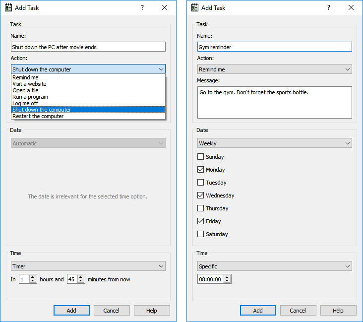

# Task Automator

Task Automator is a free program that allows you to schedule your computer to
do something, such as displaying a message every day at a specific time, or
turning off the computer in two hours.

This is a hobby project of mine and it is ready for real-world use.
I will not accept pull requests.

# License

Task Automator Copyright (C) 2010-2022 Daniel T. McGinnis

Task Automator is licensed under the GNU AGPLv3 license as published by the Free Software Foundation.
